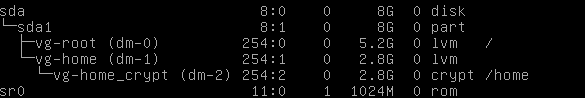
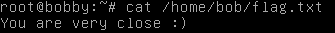
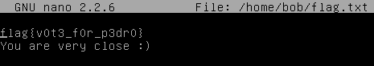

Hacklu 2015 CTF - Dr. Bob
## Details

| Contest  | Challenge | Category | Points |
| :------- | :-------- | :------- | :----- |
| Hacklu   | Dr. Bob   | forensics| 150    |

*Description*
>There are elections at the moment for the representative of the students and the winner will be announced tomorrow by the head of elections Dr. Bob. The local schoolyard gang is gambling on the winner and you could really use that extra cash. Luckily, you are able to hack into the mainframe of the school and get a copy of the virtual machine that is used by Dr. Bob to store the results. The desired information is in the file /home/bob/flag.txt, easy as that.

[source link 1](https://school.fluxfingers.net/static/chals/dr_bob_e22538fa166acecc68fa17ac148dcbe2.tar.gz)

[source link 2(mirror)](https://mega.nz/#!qoUDxYrB!W-C6vZxiulkaZ9ONWbyohCpAOfRbLtvHIgIICvjeZWk)

----

### Write-up

We have a virtual machine with a saved state.
After resetting the password from the root.
> 1) Loading to GRUB

> 2) press 'e' for edit boot options

> 3) add to end of string ```init=/bin/bash```

> 4) ctrl+x

> 5) passwd

 We find that there are two partitions, one of which is encrypted.



So you need to reset the password without rebooting the machine.

Restoring machine.

Opened in hex editor Safe.vdi and replaced all password hash of root user.

For example:

```
root:$6$/QrtDuz4$3mMh7Wa31i7XAZ8mEoseUDV.Od3YPELXPgGwD37zEjMwFYObwcXw1LExdvS/LBSTKOtzpU0R/eVtDZWv4PA1g1:16729:0:99999:7:::
```

password:1337

Start the machine, I successfully completed login.

Try cat /home/bob/flag.txt



Try nano /home/bob/flag.txt



successfully

---

Flag:flag{v0t3_f0r_p3dr0}
